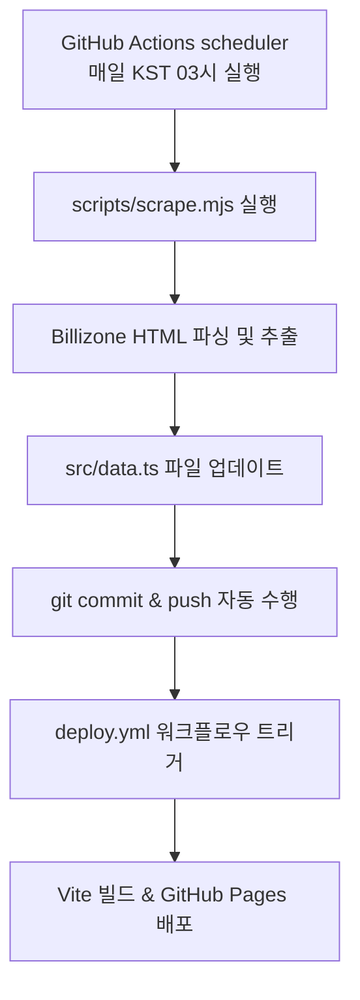

# 📋 프로젝트 요약 — 매니아 당구클럽 9샷 멤버스

## 🎯 프로젝트 개요

안양 매니아 당구클럽 동호인 중 **'9샷' 멤버들의 실시간 랭킹, 모임비 정산, 스타크래프트 팀 매칭**을 아우르는 동호회 대시보드 웹 애플리케이션.  
GitHub Pages(`bloodmas78.github.io`)를 통해 정적 사이트로 배포됩니다.

---

## 🛠️ 기술 스택

| 구분 | 기술 | 버전 | 비고 |
|------|------|------|------|
| **프레임워크** | React | ^19.2.6 | 웹 프레임워크 |
| **라우팅** | React Router | ^7.18.0 | 클라이언트 사이드 라우팅 |
| **3D 그래픽** | Three.js | ^0.185.0 | (패키지 설치됨, 향후 시각화/효과용) |
| **언어** | TypeScript | ~6.0.2 | 타입 안정성 확보 |
| **번들러** | Vite | ^8.0.12 | 빌드 및 개발 환경 |
| **크롤러** | Cheerio | ^1.1.0 | Billizone 데이터 수집용 |
| **린터** | ESLint | ^10.3.0 | 코드 컨벤션 및 정적 분석 |
| **폰트** | Google Fonts — Outfit | 300–700 | 타이포그래피 |
| **배포** | GitHub Pages (GitHub Actions) | — | 정적 호스팅 및 자동 배포 |

---

## 📂 디렉토리 구조

```
bloodmas78.github.io/
├── .cursorrules                # 에이전트 커스텀 룰 설정
├── .github/
│   └── workflows/
│       ├── deploy.yml          # GitHub Pages 자동 배포 워크플로우 (Vite 빌드 후 배포)
│       └── scrape.yml          # Billizone 랭킹 데이터 수집 워크플로우 (매일 KST 3시)
├── public/
│   ├── 404.html                # SPA 라우팅 폴백용 404 페이지
│   ├── favicon.svg             # 파비콘
│   └── icons.svg               # 아이콘 스프라이트
├── scripts/
│   └── scrape.mjs              # Billizone 크롤링 및 데이터 생성 스크립트 (Cheerio)
├── src/
│   ├── assets/                 # 이미지 및 미디어 자산
│   │   ├── hero.png            # (레거시) 히어로 이미지
│   │   ├── protoss_crystal.png # 팀 매칭 페이지 프로토스 카이다린 수정 이미지 (AI 생성)
│   │   ├── react.svg
│   │   └── vite.svg
│   ├── pages/                  # 개별 메뉴 페이지 컴포넌트
│   │   ├── Home.tsx            # 메인 홈 화면 (각 기능으로의 내비게이션 카드 제공)
│   │   ├── Ranking.tsx         # Billizone 연동 9샷 멤버 랭킹 대시보드 (3쿠션 테마)
│   │   ├── Settlement.tsx      # 모임비/당구비 차수별 N분의 1 정산 계산기
│   │   └── Random.tsx          # 스타크래프트 프로토스 테마 균형 팀 매칭기
│   ├── App.css                 # 메인 앱 스타일 & 반응형 미디어 쿼리 (~3,100줄)
│   ├── App.tsx                 # React Router 라우팅 설정 및 공통 UI
│   ├── data.ts                 # 멤버 데이터 (크롤링 스크립트에 의해 자동 생성)
│   ├── index.css               # 글로벌 스타일 & CSS 공통 변수
│   └── main.tsx                # React 엔트리 포인트 (BrowserRouter 래핑)
├── dist/                       # 빌드 산출물 (Git 추적 제외)
├── index.html                  # HTML 엔트리 포인트
├── package.json                # 의존성 설정
├── project.md                  # 프로젝트 문서 (본 파일)
├── vite.config.ts              # Vite 설정
├── tsconfig.json               # TypeScript 공통 설정
├── tsconfig.app.json           # TypeScript 앱 설정
├── tsconfig.node.json          # TypeScript Node 설정
└── eslint.config.js            # ESLint 설정
```

---

## 🗺️ 라우팅 구조

| 경로 | 컴포넌트 | 설명 |
|------|----------|------|
| `/` | `Home` | 메인 포털 대시보드 |
| `/9shot` | `Ranking` | 멤버 랭킹 대시보드 |
| `/n1` | `Settlement` | 모임비 정산기 |
| `/random` | `Random` | 스타크래프트 팀 매칭기 |
| `*` | `Navigate → /` | 404 폴백 |

---

## 🎨 디자인 특징

- **그린 펠트 당구대 테마 (랭킹)**: 3쿠션 당구대 천 느낌의 소프트 펠트 그린 배경, 포켓 없는 캐롬 테이블 디자인, 빨강·노랑·흰색 3구 볼 로고
- **모던 카드 UI (홈)**: 카카오톡 스타일에서 영감을 받은 쾌적하고 밝은 톤의 글래스모피즘 카드 레이아웃
- **스타크래프트 프로토스 테마 (팀 매칭)**: 네온 시안/골드 글로우 효과, 다크 우주 톤 배경, 사이오닉 스캐너 레이저 애니메이션, 카이다린 수정 부양 효과
- **프리미엄 정산 UI**: 카카오 공유 포맷 정산 요약, 0원 멤버 자동 필터링, 송금 계좌번호 localStorage 저장
- **마이크로 애니메이션**: `fadeIn`, `slideUp`, `protossScan`, `protossFloat`, `warpSpin` 등 다채로운 인터랙션 효과
- **반응형 레이아웃**: CSS Grid 및 미디어 쿼리를 사용하여 모바일(680px), 태블릿(820px), 데스크톱(1024px) 3단계 반응형 지원

---

## ⚙️ 주요 기능

### 1. 메인 홈 화면 (`Home.tsx`)
- 당구 랭킹, 모임비 정산, 스타크래프트 팀 매칭으로 바로 갈 수 있는 포털형 대시보드 인터페이스.
- 깔끔하고 모던한 카드형 링크 및 카카오톡 공유 포맷 느낌의 정산 요약 연계 디자인.
- 퀵 스탯 바(Quick Stats Bar): 멤버 수, 이달의 1위, 최고 하이런을 한눈에 표시.

### 2. 멤버 랭킹 대시보드 (`Ranking.tsx`)
- **3쿠션(캐롬) 당구대 테마**: 포켓 없는 3구 당구대 배경, 빨강·노랑·흰색 캐롬볼 3D 로고 헤더.
- **월간 기록 랭킹**: Billizone 기준 정렬 기능 제공.
- 에버리지(Average), 하이런(Highrun), 승률(Win Rate) 기준 정렬 필터.
- 멤버 카드별 에버리지, 하이런, 승·무·패 기록 및 승률 바(progress bar) 시각화.
- 기록이 미달(10경기 이상 미달 등)하여 랭킹이 없거나 미집계된 멤버에 대해 empty state 표시.

### 3. 모임비 정산기 (`Settlement.tsx`)
- **다차수 계산**: 1차, 2차, 3차 등 모임 차수별로 장소, 총비용, 참석 멤버를 각각 지정 가능.
- **올림 자동 계산**: 1인당 정산 금액 계산 시 100원 단위로 절상(`Math.ceil`) 처리하여 모임 주최자의 잔돈 부담 최소화.
- **실시간 요약**: 전체 금액 합계 및 차수별 참석자가 표시되며, 멤버별로 내야 할 최종 금액을 실시간 계산하여 정렬.
- **0원 멤버 자동 숨김**: 정산 금액이 0원인 멤버는 UI 요약 목록과 클립보드 복사 텍스트에서 자동으로 제외.
- **카카오톡 정산요약 복사**: 송금 계좌번호를 포함한 정산 텍스트를 클립보드에 복사하여 카카오톡으로 바로 공유 가능. 계좌번호는 `localStorage`에 자동 저장.
- **클릭 하이라이트**: 멤버 선택 시 해당 멤버의 정산 금액 카드가 강조 표시되어 정산 여부 체크 편리.

### 4. 스타크래프트 팀 매칭기 (`Random.tsx`)
- **실력 맞춤형 밸런싱**: 참석 멤버를 선택한 후 실력(상: 30, 중: 25, 하: 20)을 설정하여, 양 팀의 실력 합계 차이가 최소가 되도록 브루트포스 조합 알고리즘으로 최적의 A팀 / B팀 생성.
- **최대 9명 지원**: 홀수 인원(예: 5명, 7명) 참여 시 컴퓨터(실력 점수: 10)를 자동으로 배치하여 짝수가 되도록 매칭 보완. 컴퓨터는 항상 명단 최하단에 표시.
- **승률 예측**: 각 팀의 총점 비율을 기반으로 예상 승률(%)을 사이오닉 전력 균형 게이지(Tug-of-War 바)로 시각적 표시.
- **랜덤 셔플**: 동일한 점수 차이의 조합이 여러 개 존재할 시 매번 무작위로 팀 조합을 선택하여 셔플 효과 부여.
- **TEMPLAR / NERAZIM 진영 뱃지**: A팀(TEMPLAR), B팀(NERAZIM) 진영 엠블럼 배지 및 승률 표시.
- **Warp Gate 로딩 애니메이션**: 팀 매칭 계산 시 약 850ms의 차원 관문 포털 애니메이션 연출.
- **프로토스 비주얼 배너**: AI 생성 카이다린 수정 이미지, 사이버 스캔 레이저 빔, 수정 부양 효과 등 SC 세계관 시각 효과.

---

## 📊 데이터 구조

### `Member` 인터페이스
```typescript
interface Member {
  nickname: string;        // 멤버 닉네임 (예: "9샷캐리")
  avatarColor: string;     // 아바타 배경색 (hex)
  monthly: StatDetail | null;  // 월간 기록 (없으면 null)
  allTime: StatDetail | null;  // 누적 기록 (없으면 null)
}
```

### `StatDetail` 인터페이스
```typescript
interface StatDetail {
  average: number;     // 에버리지
  highrun: number;     // 하이런
  win: number;         // 승수
  draw: number;        // 무승부
  loss: number;        // 패배
  winRate: number;     // 승률 (%)
  ranks: {
    average: number | null;
    highrun: number | null;
    winRate: number | null;
  };
}
```

### 현재 등록된 멤버 (8명)
| 닉네임 | 아바타 컬러 | 비고 |
|--------|-----------|------|
| 9샷캐리 | 🟣 `#c084fc` | 에버 랭크 상위권 |
| 9샷윽고 | 🔵 `#60a5fa` | 에버 랭크 상위권 |
| 9샷마스웨이 | 🟢 `#34d399` | 10게임 미만 시 월간 기록 미반영 |
| 9샷레이첼 | 🩷 `#f472b6` | 10게임 미만 시 월간 기록 미반영 |
| 9샷케인장 | 🟡 `#fbbf24` | 누적 기록 보유 멤버 |
| 9샷Rei | 🔴 `#fb7185` | 공식 경기 및 월간 기록 수집 멤버 |
| 9샷애호박 | 🟣 `#a78bfa` | 활동 및 공식경기 대기 멤버 |
| 9샷쿤 | 🟢 `#2dd4bf` | 활동 및 공식경기 대기 멤버 |

> **참고**: 멤버 데이터는 `scripts/scrape.mjs`를 통해 Billizone 클럽 랭킹 페이지에서 스크랩하여 자동으로 갱신됩니다.

---

## 🤖 자동 데이터 동기화 & 크롤링 파이프라인

최신 전적 데이터를 유지하기 위해 자동화 스크립트와 CI/CD 배포망이 결합되어 동작합니다.



1. **데이터 크롤러 (`scripts/scrape.mjs`)**:
   - `cheerio` 라이브러리를 사용하여 Billizone 당구 매니아클럽 랭킹 웹페이지의 월간 및 누적 랭킹 표 데이터를 읽어옵니다.
   - 각 멤버의 에버리지, 하이런, 승·무·패, 승률 등을 파싱하여 `src/data.ts` 포맷으로 갱신합니다.
2. **자동 스케줄러 (`.github/workflows/scrape.yml`)**:
   - 매일 한국 시간 기준 오전 3시(UTC 18시)에 스케줄러가 돌아가 `npm run scrape`를 구동합니다.
   - 데이터 파일 변경 사항이 있을 시 `github-actions[bot]` 명의로 자동 커밋 및 푸시하여 최신 랭킹 대시보드가 항상 유지되도록 갱신합니다.

---

## 🚀 배포 파이프라인

- **트리거**: `master` (또는 메인 배포 브랜치)에 push 시 자동 실행 (수동 크롤링 커밋 푸시 포함)
- **프로세스**: Checkout → Node 20 설정 → `npm ci` → `npm run build` → GitHub Pages 배포
- **빌드 산출물**: `./dist` 디렉토리
- **배포 대상**: GitHub Pages (`bloodmas78.github.io`)

---

## 📝 스크립트

| 명령어 | 설명 |
|--------|------|
| `npm run dev` | Vite 개발 서버 실행 |
| `npm run build` | TypeScript 컴파일 + Vite 프로덕션 빌드 |
| `npm run lint` | ESLint 실행 |
| `npm run preview` | 빌드 결과물 미리보기 |
| `npm run scrape` | Billizone 클럽 웹페이지 데이터 직접 크롤링 |

---

## 💡 향후 개선 가능 사항

- [x] 데이터 자동 크롤링 연동 (GitHub Actions + Cheerio 스케줄링 동기화 완료)
- [x] 더 많은 멤버 데이터 추가 (8명으로 확장 완료)
- [x] 라우팅 및 다기능 페이지 구현 (홈 화면, 정산기, 스타크래프트 팀 매칭기 추가 완료)
- [x] 3쿠션(캐롬) 당구대 테마 적용 (포켓 제거, 3구 볼 로고)
- [x] 정산 페이지 0원 멤버 자동 숨김 & 카카오톡 복사 기능
- [x] 스타크래프트 팀 매칭 프로토스 테마 비주얼 업그레이드
- [x] 팀 매칭 결과에서 컴퓨터 항상 최하단 배치
- [ ] 멤버 상세 페이지 / 프로필 모달
- [ ] 대전 기록 히스토리 뷰
- [ ] Three.js 등을 이용한 3D 시각화 또는 차트/그래프 시각화 (에버리지 추이 등)
- [ ] PWA(Progressive Web App) 지원
