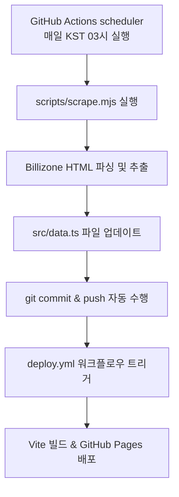

# 📋 프로젝트 요약 — 매니아 당구클럽 9샷 멤버스

## 🎯 프로젝트 개요

안양 매니아 당구클럽 동호인 중 **'9샷' 멤버들의 실시간 랭킹 & 전적 대시보드** 웹 애플리케이션.  
GitHub Pages(`bloodmas78.github.io`)를 통해 정적 사이트로 배포됩니다.

---

## 🛠️ 기술 스택

| 구분 | 기술 | 버전 |
|------|------|------|
| **프레임워크** | React | ^19.2.6 |
| **언어** | TypeScript | ~6.0.2 |
| **번들러** | Vite | ^8.0.12 |
| **크롤러** | Cheerio | ^1.1.0 |
| **Vite 플러그인** | @vitejs/plugin-react | ^6.0.1 |
| **린터** | ESLint | ^10.3.0 |
| **폰트** | Google Fonts — Outfit | 300–700 |
| **배포** | GitHub Pages (GitHub Actions) | — |

---

## 📂 디렉토리 구조

```
bloodmas78.github.io/
├── .github/
│   └── workflows/
│       ├── deploy.yml          # GitHub Pages 자동 배포 워크플로우
│       └── scrape.yml          # Billizone 랭킹 데이터 수집 워크플로우 (매일 3시)
├── public/
│   ├── favicon.svg             # 파비콘
│   └── icons.svg               # 아이콘 스프라이트
├── scripts/
│   └── scrape.mjs              # Billizone 크롤링 및 데이터 생성 스크립트 (Cheerio)
├── src/
│   ├── assets/                 # 이미지 등 정적 자산
│   │   ├── hero.png
│   │   ├── react.svg
│   │   └── vite.svg
│   ├── App.css                 # 메인 앱 스타일 & 반응형 미디어 쿼리
│   ├── App.tsx                 # 메인 앱 컴포넌트 & 대시보드 로직
│   ├── data.ts                 # 멤버 데이터 (스크립트에 의해 자동 생성)
│   ├── index.css               # 글로벌 스타일 & CSS 변수
│   └── main.tsx                # React 엔트리 포인트
├── dist/                       # 빌드 산출물
├── index.html                  # HTML 엔트리 포인트
├── package.json
├── vite.config.ts
├── tsconfig.json
├── tsconfig.app.json
├── tsconfig.node.json
└── eslint.config.js
```

---

## 🎨 디자인 특징

- **초록색 당구대 펠트 테마**: 당구대 천 느낌의 소프트 펠트 그린 `#ecf3ee` 배경 및 화이트톤 글래스모피즘 카드 UI
- **클래식 당구 펠트 그린 액센트**: `#0f766e` (Simonis Green) 기반의 소프트 글로우 효과
- **마이크로 애니메이션**: `fadeIn`, `slideUp` 트랜지션 적용
- **반응형 레이아웃**: 768px 이하 모바일 대응 미디어 쿼리
- **CSS Grid**: 멤버 카드 그리드(`auto-fill, minmax(340px, 1fr)`)

---

## ⚙️ 주요 기능

### 1. 멤버 랭킹 대시보드
- **월간 기록** / **누적 전체 기록** 탭 전환
- 에버리지(Average), 하이런(Highrun), 승률(Win Rate) 기준 정렬
- 멤버 닉네임 검색
- 필터링: 모든 멤버 / 월간 기록 보유자 / 누적 기록 보유자

### 2. 요약 통계 패널
- 활성 멤버 수
- 기록된 총 경기 수
- 최고 에버리지
- 최고 하이런

### 3. 멤버 카드
- 아바타 (닉네임 앞 2글자 + 고유 컬러)
- 에버리지 / 하이런 / 승률 + 각 항목 순위
- 승·무·패 전적 및 승률 프로그레스 바
- 기록 미보유 시 빈 상태(empty state) UI

---

## 📊 데이터 구조

### `Member` 인터페이스
```typescript
interface Member {
  nickname: string;        // 멤버 닉네임 (예: "9샷캐리")
  avatarColor: string;     // 아바타 배경색 (hex)
  monthly: StatDetail | null;  // 월간 기록 (없으면 null)
  allTime: StatDetail | null;  // 누적 기록 (없으면 null)
}
```

### `StatDetail` 인터페이스
```typescript
interface StatDetail {
  average: number;     // 에버리지
  highrun: number;     // 하이런
  win: number;         // 승수
  draw: number;        // 무승부
  loss: number;        // 패배
  winRate: number;     // 승률 (%)
  ranks: {
    average: number | null;
    highrun: number | null;
    winRate: number | null;
  };
}
```

### 현재 등록된 멤버 (5명)
### 현재 등록된 멤버 (8명)
| 닉네임 | 아바타 컬러 | 월간 기록 (6월) | 누적 기록 | 비고 |
|--------|-----------|--------------|----------|-----|
| 9샷캐리 | 🟣 `#c084fc` | ✅ | ✅ | 에버 랭크 상위권 |
| 9샷윽고 | 🔵 `#60a5fa` | ✅ | ✅ | 에버 랭크 상위권 |
| 9샷마스웨이 | 🟢 `#34d399` | ✅ | ❌ | 10게임 미만 누적기록 없음 |
| 9샷레이첼 | 🩷 `#f472b6` | ✅ | ❌ | 10게임 미만 누적기록 없음 |
| 9샷케인장 | 🟡 `#fbbf24` | ❌ | ✅ | 6월 게임 미달 |
| 9샷Rei | 🔴 `#fb7185` | ✅ | ❌ | 6월 게임만 수집 |
| 9샷애호박 | 🟣 `#a78bfa` | ❌ | ❌ | 활동 및 공식경기 없음 |
| 9샷쿤 | 🟢 `#2dd4bf` | ❌ | ❌ | 활동 및 공식경기 없음 |

> **참고**: 멤버 데이터는 `scripts/scrape.mjs`를 통해 Billizone 클럽 랭킹 페이지에서 스크랩하여 자동으로 갱신됩니다.

---

## 🤖 자동 데이터 동기화 & 크롤링 파이프라인

최신 전적 데이터를 유지하기 위해 자동화 스크립트와 CI/CD 배포망이 결합되어 동작합니다.



1. **데이터 크롤러 (`scripts/scrape.mjs`)**:
   - `cheerio` 라이브러리를 사용하여 Billizone 당구 매니아클럽 랭킹 웹페이지의 월간 및 누적 랭킹 표 데이터를 읽어옵니다.
   - 각 멤버의 에버리지, 하이런, 승·무·패, 승률 등을 파싱하여 `src/data.ts` 포맷으로 갱신합니다.
2. **자동 스케줄러 (`.github/workflows/scrape.yml`)**:
   - 매일 한국 시간 기준 오전 3시(UTC 18시)에 스케줄러가 돌아가 `npm run scrape`를 구동합니다.
   - 데이터 파일 변경 사항이 있을 시 `github-actions[bot]` 명의로 자동 커밋 및 푸시하여 최신 랭킹 대시보드가 항상 유지되도록 갱신합니다.

---

## 🚀 배포 파이프라인

- **트리거**: `master` 브랜치에 push 시 자동 실행 (수동 크롤링 커밋 푸시 포함)
- **프로세스**: Checkout → Node 20 설정 → `npm ci` → `npm run build` → GitHub Pages 배포
- **빌드 산출물**: `./dist` 디렉토리
- **배포 대상**: GitHub Pages (`bloodmas78.github.io`)

---

## 📝 스크립트

| 명령어 | 설명 |
|--------|------|
| `npm run dev` | Vite 개발 서버 실행 |
| `npm run build` | TypeScript 컴파일 + Vite 프로덕션 빌드 |
| `npm run lint` | ESLint 실행 |
| `npm run preview` | 빌드 결과물 미리보기 |
| `npm run scrape` | Billizone 클럽 웹페이지 데이터 직접 크롤링 |

---

## 💡 향후 개선 가능 사항

- [x] 데이터 자동 크롤링 연동 (GitHub Actions + Cheerio 스케줄링 동기화 완료)
- [x] 더 많은 멤버 데이터 추가 (8명으로 확장 완료)
- [ ] 멤버 상세 페이지 / 프로필 모달
- [ ] 대전 기록 히스토리 뷰
- [ ] 차트/그래프 시각화 (에버리지 추이 등)
- [ ] PWA(Progressive Web App) 지원

